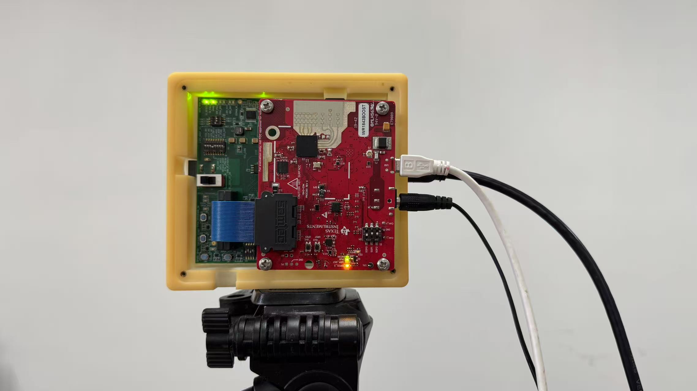
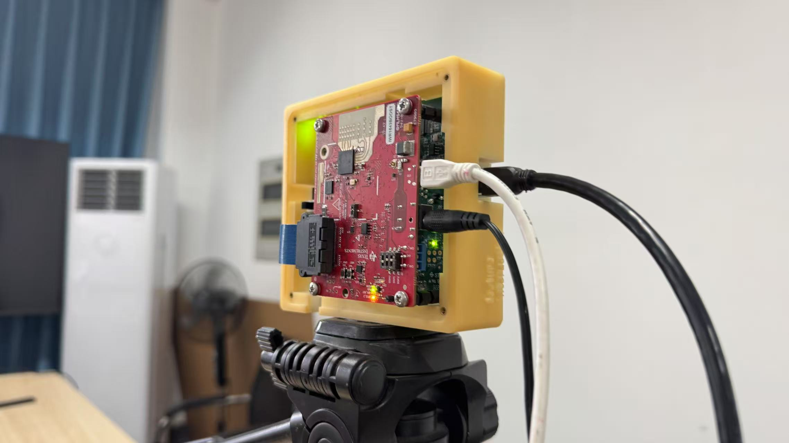

# RadarStream

RadarStream is a real-time RAWDATA acquisition, processing, and visualization system for TI MIMO mmWave radar series.


https://github.com/user-attachments/assets/7ce99b51-a1af-4025-8a84-ee580eb92d04

Demo1: Real-time Motion Detection and Radar Feature Visualization
<figure>
  
  <figcaption>Demo2: Real-time Gesture Recognition System</figcaption>
</figure>

## Project Overview

This system supports Texas Instruments' MIMO mmWave radar series for real-time raw data acquisition, processing, and visualization. In addition to the RF evaluation board, the DCA1000EVM is required for data capture. Currently, the system has been tested with:
- IWR6843ISK
- IWR6843ISK-OBS
- IWR1843ISK

If you encounter any issues while using this project, please feel free to submit a pull request.

## Features

- Real-time radar data acquisition from TI MIMO mmWave radar sensors
- Multi-dimensional feature extraction:
  - Range-Time Information (RTI)
  - Doppler-Time Information (DTI)
  - Range-Doppler Information (RDI)
  - Range-Azimuth Information (RAI)
  - Range-Elevation Information (REI)
- Interactive visualization interface

## Requirements

- Python 3.6+
- PyQt5
- PyQtGraph
- NumPy
- PyTorch
- Matplotlib
- Serial

## Hardware Requirements

- TI MIMO mmWave Radar Sensor (tested with IWR6843ISK and IWR6843ISK-OBS)
- DCA1000 EVM (essential for raw data capture)
- PC with Windows OS 

## Firmware Requirements
The firmware must be selected from the `mmwave_industrial_toolbox_4_10_1\labs\Out_Of_Box_Demo\prebuilt_binaries/` directory inside any version of the mmwave_industrial_toolbox.  
There is no strict requirement to use version 4.10.1.

## Setup and Installation

1. Clone this repository
2. Install the required dependencies:
   ```
   pip install pyqt5 pyqtgraph numpy torch matplotlib pyserial
   ```
3. Connect the mmWave radar sensor and DCA1000 EVM to your computer (only need a 5V 3A DC power wire,  a Ethernet Cable, and a micro USB wire)
4. Configure the network IPv4 settings (referencing the IPv4 configuration process from using mmWaveStudio for the DCA1000 EVM)

Two different acquisition methods are shown here: one figure displays Raspberry Pi 4B acquisition, while the other demonstrates Windows-based  acquisition. However, the Raspberry Pi acquisition has very few frames during real-time processing and display, making it prone to data loss. (not recommended to use Raspberry Pi for acquisition)

<p align="center">
  
  
  
  
</p>

## 3D Printed Mount

The repository includes STL files for a 3D printed structure designed to mount and secure the DCA1000EVM board.

**Note:** You will need some M3 size nylon standoffs and screws for assembly.

<p align="center">
  
</p>

## Usage

1. Run the main application:
   ```
   python main.py
   ```
2. Select the appropriate COM port for the radar CLI interface
3. Choose a radar configuration file
4. Click "Send Config" to initialize the radar
5. Use the interface to:
   - Visualize radar data in real-time
   - Capture training data for machine learning models


## Project Structure
- `config/`: Configuration files for different radar settings
- `gesture_icons/`: Gesture icons for visualization
- `libs/`: Library files for radar communication
- `STL3D`: 3D printed mount STL files
- `main.py`: Main application entry point
- `real_time_process.py`: Real-time data processing
- `radar_config.py`: Radar configuration utilities
- `iwr6843_tlv/`: TLV protocol implementation for IWR6843
- `dsp/`: Digital signal processing modules
- `UI_interface.py`: PyQt5 user interface


## Citation

If this project helps your research, please consider citing our papers that are closely related to this tool:

```

```


## Acknowledgements

This project references and builds upon:
- [real-time-radar](https://github.com/AndyYu0010/real-time-radar) by AndyYu0010
- [OpenRadar](https://github.com/PreSenseRadar/OpenRadar) - specifically the DSP module

## TODO

Future improvements planned for this project:
- [ ] Validate compatibility with more RF evaluation boards
- [ ] Migrate from PyQt5 to PySide6
- [ ] Make the API in the libs folder more flexible
